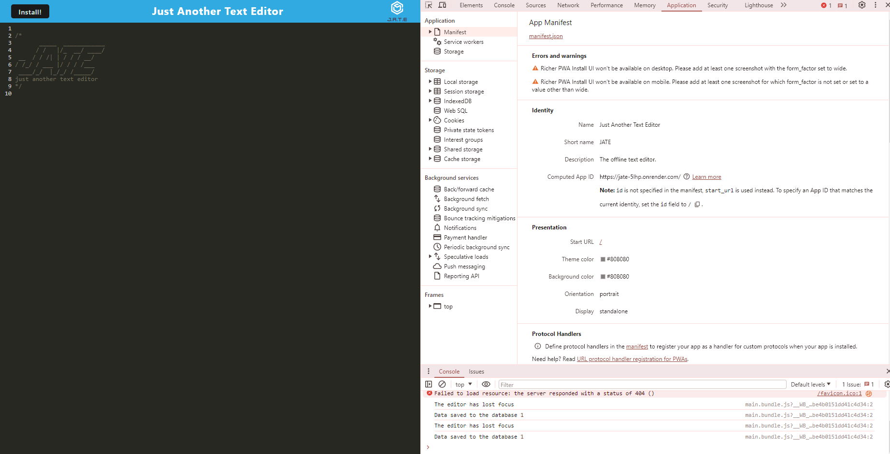
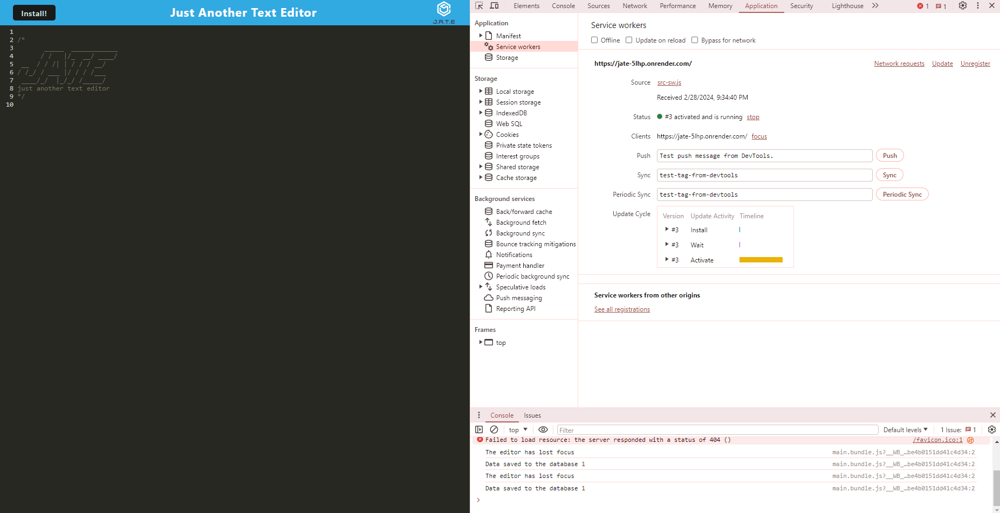

  # PWA Just another text editor

## Description
Just another text editor (J.A.T.E) is a progressive web application that runs both in the browser and is downloadable to be used for offline purposes. This web app uses a combined list of packages inorder to provide a in browser javascript writing experience that saves your progress. It uses indexedDB for a database, Workbox and a service worker.

## Table of Contents
- [Installation](#installation)
- [Usage](#usage)
- [License](#license)
- [Tests](#tests)
- [Questions](#questions)

## Installation
1. download current repository
2. run 'npm i' in the github repo folder
3. Start deployment with 'npm run start'

## Usage
To allow the user to write code on a seperate browser interface while on/offline

## License
This project is licensed under the MIT license.
For more information, please visit https://opensource.org/licenses/MIT

## Tests
No major tests were run excluding the downloading for offline functionality.

## Questions
For any questions, please contact me at [JoshuaPEagan@outlook.com](mailto:JoshuaPEagan@outlook.com).

GitHub: [KaiserGandros](https://github.com/KaiserGandros)